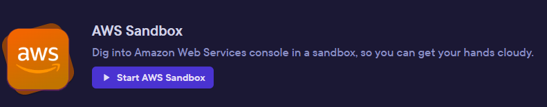
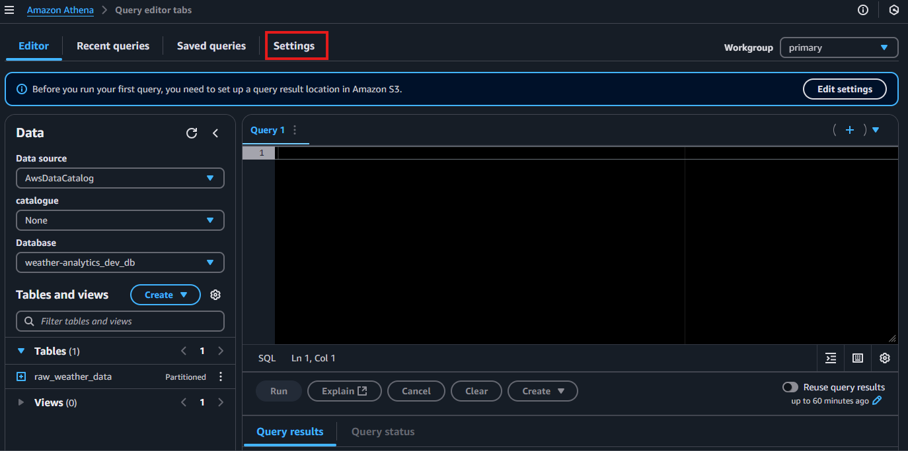

---
jupytext:
  formats: md:myst
  text_representation:
    extension: .md
    format_name: myst
kernelspec:
  display_name: Python 3
  language: python
  name: python3
---

# Data Engineer Workshop 9: Advanced Stream Processing Pipelines

## Introduction

### Reminder of Workshop 5 - Data Integration with Cloud Services

In Workshop 5, we explored .... Let's recap what we did:

1. **Environment Setup**
  - 

2. **Data Transformation**
  - 

- In today's workshop, we'll build on this foundation by implementing ...

```{note}
In Workshop 5, the ...
```
````{dropdown} For more detail on ..., click here
In Workshop 5, the ...

Today, we'll build on this to demonstrate ....
````

### Streaming, real time or near real time? What's the difference?


```{note}
While our focus today is on ...
```
````{dropdown} For more detail on ...., click here
In this workshop, ..
````

```{admonition} Question
Can you remember the difference between A and B?
```
`````{hint}
:class: dropdown
Think about ....
````{dropdown} For the solution, click here
The answer is ....
````
`````

### Applying Each Workshop to Your Project

Let's consider again how each workshop's approach might fit your specific needs, regardless of the data source type or format:

```{admonition} Reflect on Your Journey
Think about which patterns could work for you:

1. **Workshop 3: Initial Star Schema**
   - **What we did**: Built a static dimensional model.
   - **Practical takeaway**: While a one-off load isn't suitable for production, you might refresh your entire model periodically. Either way, getting your star schema design right is essential before adding automation.
   - **Project question**: Could periodic full refreshes work for your data, or do you need more frequent updates? Does the format of your source (e.g., OLTP database, API, or flat file) affect your approach?

2. **Workshop 4: Denormalised Data with Full Refresh**
   - **What we did**: Loaded Companies House CSV data (already denormalised) into a simple table.
   - **Practical takeaway**: Many data sources provide ready-to-load flat files, unlike the normalised Sakila database we're using today.
   - **Project question**: Is your source data already flattened like Companies House, or do you need to transform a normalised or semi-structured source (e.g., JSON or XML)?

3. **Workshop 5: Serverless File Analysis**
   - **What we did**: Direct querying of S3 files through AWS Athena.
   - **Practical takeaway**: Sometimes maintaining a database is overkill when you can query files directly.
   - **Project question**: Is your data best managed in a database, or could a serverless query approach suffice? For instance, does your source format (e.g., log files, IoT data) favour file-based analysis?

4. **Workshop 6: Detailed Design**
   - **What we did**: Specifications for dimensions and ETL processes.
   - **Practical takeaway**: Planning your data flows and transformation rules saves major headaches later.
   - **Project question**: Have you documented how your data flows and transformations will handle different source formats (e.g., structured databases, semi-structured APIs)?

5. **Workshop 7: Automated Updates**
   - **What we did**: Incremental dimension updates in Azure Synapse.
   - **Practical takeaway**: Processing only what's changed is efficient for frequently updated data.
   - **Project question**: What is your strategy for handling data changes from diverse sources (e.g., timestamp tracking in databases, new files in a directory, or API data deltas)? We’ll explore this today.

Looking ahead, we'll explore more patterns such as:

6. **Workshop 9 (Today): Stream Processing**
   - **What we'll cover**: Processing data in real-time as it arrives.
   - **Project relevance**: If batch updates aren't fast enough, streaming might be appropriate for certain sources, like IoT sensors or transactional events.

7. **Workshop 13: API Integration**
   - **What we'll cover**: Pulling data directly from one or more API sources.
   - **Project relevance**: When your data lives in cloud services or external systems rather than the databases or files we've focused on so far.
```

### Moving Forward With Your Project

As you now consider the stream processing:

1. **Choose Your Pattern**: Is your use case best served by:
  - Regular full refreshes (like Workshop 4's Companies House approach)?
  - Direct file querying (like Workshop 5's serverless pattern)?
  - Incremental updates (like Workshop 7's Type 1 SCD implementation)?
  - Or perhaps streaming as in today's workshop 9.

2. **Stream Appropriately**: Remember that complex solutions aren't always better:
  - A simple near real time..
  - This morning's exercise demonstrates one approach, but your project might need something simpler or more complex. We'll discuss the approaches after lunch, focusing on finding the right fit for your specific business needs!
  - Fo instance, in this Tweet, it is suggested that.. https://x.com/EcZachly/status/1875002741711626444

### Alignment with Data Engineer Pass Descriptors

```{note}
This workshop aligns with several IFATE Data Engineer Pass Descriptors: https://www.instituteforapprenticeships.org/apprenticeship-standards/data-engineer-v1-0
```
````{dropdown} Click here to review more detail
- **Explains techniques such as star schemas, data lakes and data marts and the impact they have on data warehousing principles. (K15)**  
 This workshop directly demonstrates this by showing how a star schema can be implemented and maintained in a data warehouse, specifically focusing on dimension table updates using SCD Type 1.

- **Describes the types and uses of data engineering tools in their own organisation and how they apply them. (K20)**  
 The workshop covers multiple Azure data engineering tools (Azure SQL, Azure Synapse, Dedicated SQL Pools) and shows their practical application in building a data warehouse update pipeline, demonstrating how each tool serves a specific purpose in the overall architecture.

- **Explains the deployment approaches processes for new data pipelines and automated processes. (K8)**  
  We walk through the complete deployment of a new data pipeline in Azure Synapse, from setting up the infrastructure to implementing and testing the automated update process.

- **Explains how they monitor different types of data store to optimise system management, performance and availability. (K1, S7)**  
  We will implement audit logging tables to track pipeline success, and consideration of table distribution and udpate methods in Azure Synapse for optimised performance.

- **Describes how they use data ingestion frameworks such as streaming, batching and on demand services to move data from one location to another in order to optimise data ingestion processes. (K18, S15)**  
  We focus on batch processing and this workshop demonstrates an optimised ingestion process using staging tables and audit logging to ensure reliable data movement from OLTP to OLAP systems.
````

### Today's Workshop Scenario and Objectives

In this workshop, you’ll implement a streaming process to ....

Using AWS.... By the end of this workshop, you will have:

- Set up ...
- Created ...
- Built a ..
- Developed a streamin pipeline that:
  - ...
  - ....
- Tested the pipeline by:
  - ...
  - ...
  - ...

This workshop will provide practical experience with:
- ....
- ...
- ...
- ....
- ...

In this setup, your pipeline will perform ... main operations:
1. **...**: ...
2. **...**: A ....

By the end of the workshop, you will have built this architecture:


# Note

> Review the Glue Streaming guidance patterns starting here: https://docs.aws.amazon.com/glue/latest/dg/streaming-tutorial-studio.html

## ⚙️ Task 1: Configuring the Development Environment

> In Task 1, you will set up a development environment where weather data streaming and analytics can take place. This involves deploying a comprehensive AWS infrastructure using CloudFormation, which will create multiple interconnected services including a data ingestion pipeline (Lambda and Kinesis), storage layer (S3 data lake), and foundational analytics services (Redshift cluster and Glue database).

1. **Start an ACG AWS sandbox:** 
  - Use this link and start `AWS Sandbox - Default` and log in: https://learn.acloud.guru/cloud-playground/cloud-sandboxes <br>
  

2. **Deploy AWS CloudFormation template:** 
  - Once logged in search for `CloudFormation`. 
  - At the top, click on the far right drop down `Create stack` and select `With new resources (standard)`
  - At `Step 1: Create Stack` copy and paste this URL `https://da5corndel.s3.eu-west-2.amazonaws.com/CloudFormation_streaming.yaml` into the `Amazon S3 URL` box and click `Next`.
  <br><br>
  - At `Step 2: Specify stack details` notice how may of the parameters are pre-completed for you and don't need to be changed. The only task here is to complete `Provide a stack name`. As this name is used to create resources a simple name is recommended such as `stream`. Then click `Next`.
  <br><br>
  - At `Step 3: Configure stack options` scroll down to the bottom of the page then simply tick the check box next to the statement: `I acknowledge that AWS CloudFormation might create IAM resources with customised names.` then click `Next`.
  - At `Step 4: Configure stack options`, scroll to the bottom of the page and click the `Submit` button. Your stack (we called `stream`) will now deploy and will show `ℹ CREATE_IN_PROGRESS` while it deploys. After about 3 minutes it should show the message `ℹ CREATE_COMPLETE`.

````{dropdown} While the template deploys, click here for useful information and troubleshooting tips.
```{note}
⌚ Using an AWS CloudFormation template in this workshop saves time by automating resource setup, avoiding manual clicks in the AWS Portal.

CloudFormation templates are common in DevOps for creating consistent environments across development, testing, and production. In this workshop, the template sets up a single-node Redshift cluster (dc2.large) with basic authentication and permissive security settings to simplify access and experimentation.

This setup is for learning purposes and does not include production-grade features like private endpoints or stricter security controls. Learn more about CloudFormation templates here: https://docs.aws.amazon.com/AWSCloudFormation/latest/UserGuide/Welcome.html 
```

```{Note}
⌛ Your ACG Azure sandbox will automatically shut down and its data will be deleted after four hours. You will receive a notification one hour before the sandbox expires, allowing you to extend it for an additional four hours. Please plan your work accordingly to avoid disruptions.
```

```{Note}
🔃 If you encounter deployment issues or want to start fresh, we recommend deleting the entire sandbox from the ACG playground rather than individual resources or the CloudFormation stack. This is faster and ensures a clean slate for redeployment.

The CloudFormation stack includes retention settings for resources like S3 buckets to avoid accidental data loss, and deletion can take 15–20 minutes due to dependencies between components (e.g., Lambda, Kinesis, Redshift). If you must delete the stack, empty S3 buckets manually first, as their deletion protection will block the process.
```

```{Note}
⛔ When using AWS Glue, your ACG sandbox may shut down due to exceeding Glue DPU (Data Processing Unit) limits. You’ll receive an email titled “Your Hands-On Lab or Cloud Playground has been shut down,” explaining the suspension due to excessive DPU usage.

AWS Glue jobs, being Spark-based, provision distributed computing environments even for small tasks, which can quickly hit ACG's limits designed to prevent runaway costs. This restriction is a helpful reminder of resource management in data processing.

If your sandbox is suspended, don’t worry, this is part of learning to use powerful tools like AWS Glue. Simply start a new sandbox and redeploy the CloudFormation template, which will be ready in 3–4 minutes. Learn more about Glue DPUs and optimisation here: https://docs.aws.amazon.com/glue/latest/dg/monitor-debug-capacity.html
```
````

3. **How to explore your stack `Outputs`**
  - Once your stack shows `ℹ CREATE_COMPLETE`, click on the `Outputs` tab. This is a set of URLs created by the deployment for the key resources you will use in this workshop. Ideally keep this page open during the workhsop so you can come back here and easily navigate to different parts of the application.
  - Let's start by simply opening the S3 bucket that will be our data lake. Right click on the URL  to the right of the key `DataLakeBucketURL` and select `Open link in new tab`. This will open the S3 bucket used to store streamed weather data in this application.
  <br>
  - Great, now that you know how to quickly navigate key resources in this data streaming application, in the next section we will open and explore key resources in a logical order across this architecture, beginning with the Producer!!

   
## 🗺️ Task 2: Explore and understand your streaming application so far

> In this task, we will systematically explore the core data processing pipeline that has been provisioned for you. You'll examine how weather data flows through the ingestion layer (Lambda and Kinesis), into the storage layer (S3 data lake), creating the foundation for analytics workloads.

✨ 1. PRODUCER (Lambda)<br>
⬇️ <br>
🗃️ 2. BROKER (Kinesis Data Stream)<br>
⬇️<br>
📩 3. CONSUMER (Kinesis Firehose)<br>
⬇️<br>
📂 4. STORAGE (S3)<br>
⬇️<br>
📈 5. ANALYTICS / SERVING (Athena & Redshift)<br>

### ✨ 1 PRODUCER: Explore the Data Producer (Lambda Function):

- This represents the start where real-time weather data enters our system. The combination of Lambda and EventBridge creates a reliable, serverless data collection mechanism that will continuously feed data into our streaming pipeline. Let's explore them.
- First, from your CloudFormation `Outputs` tab, locate the `LambdaFunctionURL` and open it in a new tab.
- This Lambda function serves as our data producer - think of it as an automated weather station that collects and reports data every minute.
<br>

````{dropdown} 🌦️ Before we explore the code, let's understand our data source by clicking here to expand.
```{Note}
We're using the Open-Meteo Weather API (https://open-meteo.com/), which provides free weather data for educational and development purposes. We chose this API deliberately for our workshop because its both free and doesn't require any authentication or API keys, eliminating the complexity of credential management. This means the application starts calling the API immediately without you needing to register and manage access tokens. 

In a production environment, you'd typically need to handle API authentication, rate limiting, and usage tracking, but by removing these complexities here, we can focus purely on building our data pipeline and analytics capabilities. We will explore these important production considerations in Workshop 13: 'Integrating  API Data Sources'.
      
You can explore the API documentation at https://open-meteo.com/en/docs to understand all the available weather parameters. For our workshop, we're using just a subset of the available data (current temperature) to keep things focused, but in a real-world application, you might want to collect additional parameters like humidity, wind speed, or precipitation.
```
````

   - Let's examine how the Lambda function collects and streams weather data bey reviewing its Python code shown below.
   - The Lambda handler function manages the flow of data flow by pulling from the weather API to a Kinesis data stream. It uses `boto3` to connect to Kinesis, with the stream name configured through environment variables from our CloudFormation template.
   - The process follows a logical flow of:
        - The code stores coordinates for three UK cities (London, Manchester, Edinburgh) in a list called `locations`.
        - A helper function called ` def fetch_weather_data()` handles the API interaction, transforming raw weather data into a structured format with city name, temperature, and timestamps
        - The main processing loop (that begins with `for location in locations:`) collects data for each city from the API and streams it to a Kinesis data stream, using the city name as the partition key for organised downstream processing we will look at shortly.
        - Logging tracks successes and failures and can be seen below as the `response` object finally retunred by the overall Lambda handler function. 

````{dropdown} 🧑‍💻 Clicking here to view the Python Code in the Lambda function
```{code-block} python
import json
import boto3
import urllib.request
import os
from datetime import datetime

def lambda_handler(event, context):
    """
    Lambda handler that fetches weather data from Open-Meteo API and streams it to Kinesis.
    The function processes multiple UK cities and structures the data for downstream analytics.
    
    Args:
        event: AWS Lambda event trigger data
        context: AWS Lambda runtime information
    
    Returns:
        dict: Response containing execution status and processing summary
    """
    # Initialize Kinesis client - Lambda automatically uses the correct region
    kinesis_client = boto3.client('kinesis')
    
    # Reference the Kinesis stream created by CloudFormation
    stream_name = f"{os.environ['PROJECT_NAME']}-stream-{os.environ['ENVIRONMENT']}"

    # Define UK cities to monitor - structured for potential expansion
    locations = [
        {"city": "London", "latitude": 51.5072, "longitude": -0.1276},
        {"city": "Manchester", "latitude": 53.4808, "longitude": -2.2426},
        {"city": "Edinburgh", "latitude": 55.9533, "longitude": -3.1883}
    ]

    def fetch_weather_data(location):
        """
        Fetches current weather data for a given location using Open-Meteo API.
        
        Args:
            location (dict): Dictionary containing city name, latitude, and longitude
        
        Returns:
            dict: Weather data including city, temperature, measurement time, and collection time
                  Returns None if data fetch fails
        """
        base_url = "https://api.open-meteo.com/v1/forecast"
        params = f"?latitude={location['latitude']}&longitude={location['longitude']}&current_weather=true"
        
        try:
            response = urllib.request.urlopen(base_url + params)
            data = json.load(response)
            
            return {
                "city": location["city"],
                "temperature": data["current_weather"]["temperature"],
                "measurement_time": data["current_weather"]["time"],
                "collection_time": datetime.utcnow().isoformat(),
                "source": "open-meteo"
            }
        except Exception as e:
            print(f"Error fetching data for {location['city']}: {str(e)}")
            return None

    # Process each city and send data to Kinesis
    successfully_processed = 0
    failed_cities = []
    
    for location in locations:
        try:
            weather_data = fetch_weather_data(location)
            if weather_data:
                # Log the data being sent for monitoring and debugging
                print(f"Processing data for {location['city']}: {json.dumps(weather_data)}")
                
                # Send to Kinesis stream with city as partition key
                kinesis_client.put_record(
                    StreamName=stream_name,
                    Data=json.dumps(weather_data),
                    PartitionKey=weather_data["city"]
                )
                successfully_processed += 1
            else:
                failed_cities.append(location["city"])
        except Exception as e:
            error_message = f"Failed to process {location['city']}: {str(e)}"
            print(error_message)
            failed_cities.append(location["city"])

    # Prepare detailed execution summary
    response = {
        "statusCode": 200,
        "body": {
            "message": f"Processed {successfully_processed} of {len(locations)} cities",
            "successful_count": successfully_processed,
            "total_cities": len(locations),
            "execution_time": datetime.utcnow().isoformat()
        }
    }
    
    if failed_cities:
        response["body"]["failed_cities"] = failed_cities
        
    return response
```
````

   - Now, let's understand how this lambda function gets triggered automatically by an Amazon EventBridge rule:
        - In the `Function overview` section, in the diagram click on the `EventBridge (CloudWatch Events)` then right click on the URL that now appears in the `Configuration` section as shown below. (You could also simply search for `EventBridge` at the top of the page).
        <br>
        - Notice in the `Event schedule` the text `Fixed rate of 1 minute`. Click on the `Edit` button to the right and notice how in the `Schedule pattern` you could change the rate unit to be any number of `Minutes`, `Hours` or `Days`. Or, you could also change the schedule type to be a cron expression for specific minutes, hours, day of month, month, day of week and year.
        <br>    
        - This rule acts like an automated timer, invoking our Lambda function every minute.
        - You can verify this by watching the CloudWatch logs for this rule where will see new entries appearing every minute. To do this:
            - In the search bar at the top type `CloudWatch`, 
            - Then in the left hand menu of CloudWatch select from within `Logs`, `Log groups` then click on the Log group called `/aws/lambda/weather-analytics-producer-dev`
            <br>
            - From the list of `Log streams` click on the container with the most recent `Last event time`. Expand some log entries and see if you can find entries from the `START` and `END` of one run of the Lambda function that has been triggered by the EventBridge rule you explored earlier. These markers wrap each function execution and between them you'll see log messages showing weather data for each city. By checking the timestamps between different START entries, you can verify the function is running every minute as configured.
            <br>

```{note}
🔎 Keep an eye on the CloudWatch logs as you proceed through the workshop. They provide valuable insights into the data being collected and can help you troubleshoot any issues that arise.
```

### 🗃️ 2 BROKER: View data in the Data Stream (Kinesis):

  - We saw that the lambda function pulled weather data for three cities from the weather API and streamed those to a Kinesis data stream with the following code: `kinesis_client.put_record(StreamName=stream_name, Data=json.dumps(weather_data), PartitionKey=weather_data["city"])` Let's now explore that resource to understand how this broker works.
    
  - From your CloudFormation `Outputs` tab, locate `KinesisStreamURL` and open in a new tab.
    
  - This Kinesis stream acts as our real-time data buffer, receiving weather data from the Lambda function and temporarily storing it for downstream consumers like Kinesis Firehose. Think of it as a moving window of data that maintains records for 24 hours.
    
  - The stream uses the city name as a partition key, helping organize data for downstream processing. This partitioning ensures data from the same city goes to the same shard, maintaining order within each city's data stream. This was achieved in the Python code shown above where we set `PartitionKey=weather_data["city"]`.
    
  - Let's now use the Data Viewer to inspect data in our Kinesis Stream:
      1. Select the `Data Viewer` tab
      2. Choose the single shard available from the `Shard` drop-down
      3. From `Starting Position` drop-down, select `Trim horizon`
      4. Click `Get records` to view the most recent weather data from our cities
    <br>

```{note}
📁 Our stream uses one shard because our data volume (3 cities × 1 record/minute = 3 records/minute) is well within a single shard's capacity of 1,000 records/second. This is perfect for workshop purposes and cost-efficient. VALIDATE WITH DOCS IN GEMINI
```
```{note}
 ⌚`Trim horizon` works because it shows all records in the stream's 24-hour retention window, letting you see historical data. `Latest` might not show records immediately because it only shows data that arrives after you start viewing. Since our Lambda writes once per minute, you might need to wait for the next data collection cycle to see new records.
```

### 📩 3 CONSUMER: Examine the Data Transformation (Kinesis Firehose):
  - From your CloudFormation `Outputs` tab, locate `KinesisFirehoseURL` and open in a new tab.
    - Kinesis Firehose acts as our delivery service, taking data from the Kinesis stream and preparing it for long-term storage in S3. Let's explore its key configurations:
        - Click on the `weather-analytics-firehose-dev` delivery stream
        - Select `Edit destination settings` to view the configuration details
        <br>

    - Examine these important settings:
        - **Dynamic Partitioning**: Notice how this feature is enabled in the `Dynamic partitioning` section. It automatically organises our data in S3:
            - Enabled with a partition key based on `city` using the JQ expression `.city`
            - Creates a logical hierarchy in S3 using the prefix pattern you can see of:
              ```
              weather-data/location=!{partitionKeyFromQuery:city}/year=!{timestamp:yyyy}/month=!{timestamp:MM}/day=!{timestamp:dd}/
              ```
            - This pattern means data is automatically organised by city, year, month, and day
        
        - **Error Handling**: Notice the error output prefix:
            ```
            errors/!{firehose:error-output-type}/!{timestamp:yyyy}/!{timestamp:MM}/!{timestamp:dd}/
            ```
            This helps track and debug any processing issues by organising any error logs in a similar hierarchical structure  
        - **Buffering**: Scroll to the bottom of the page and expand the section `Buffer hints, compression, file extension and encryption`. Notice how Firehose buffers data for either:
            - 60 seconds (time-based buffer) OR
            - 64MB (size-based buffer)
            - Whichever threshold is met first triggers a write to S3
        
```{note}
📦 The buffering configuration balances between data freshness and storage efficiency. Smaller buffers mean fresher data but more S3 write operations, while larger buffers are more cost-effective but introduce more latency. Our 60-second buffer is ideal for our workshop environment where we want to see results quickly.

🗂️ The dynamic partitioning structure provides efficient querying later. By organising data by city and time components, we can quickly locate specific data subsets without scanning the entire dataset. For example, finding all London temperatures for a specific month becomes a targeted operation.
```

### 📂 4 STORAGE: Inspect the Data Lake (S3):
   - From your CloudFormation `Outputs` tab, locate `DataLakeBucketURL` and open in a new tab. 

   - This S3 bucket serves as our data lake, providing long-term storage of our weather data in an organised and cost-effective way. Let's explore its structure:
       1. Click into the `weather-data` folder
       2. Notice the hierarchical organisation created by Kinesis Firehose we explored previously:
           - First level: `location=cityname` (e.g., `location=London`)
           - Second level: `year=YYYY`
           - Third level: `month=MM`
           - Fourth level: `day=DD`
       3. Navigate down through these levels to find the actual data files
       4. Notice the `.gz` extension on the files - this indicates GZIP compression
   
   - Key features to observe:
       - **Partitioning Structure**: The folder hierarchy directly matches the Firehose prefix pattern we examined earlier:
         ```
         weather-data/location=city/year=YYYY/month=MM/day=DD/
         ```
         This isn't just tidy organisation, it supports  efficient querying
       
       - **File Formats**: 
           - Files are automatically compressed using GZIP
           - Each file contains multiple weather records collected during the 60-second buffer window
           - File names include timestamp information for easy tracking
       
       - **Lifecycle Management**: The bucket has intelligent lifecycle rules that were defined in the CloudFormation template you deployed:
           - Data moves to Infrequent Access (IA) storage after 90 days
           - Archives to Glacier storage after 180 days
           - This tiered approach optimises storage costs

```{note}
💾 The combination of GZIP compression and intelligent lifecycle policies helps manage storage costs as your data grows. For examle, in a production environment, with years of historical weather data for many more locations the savings could become significant.

🎯 The partitioned structure isn't just for organisation, it enables targeted data access. When you later query this data with Athena or process it with Glue, it can efficiently access specific time periods or locations without scanning the entire dataset.
```

### 📈 5 ANALYTICS / SERVING: Preview the Analytics Foundation:
   - Let's explore the analytical and data serving layer that will help us derive insights from our weather data. We'll examine both components:
       - AWS Glue for data cataloging and ETL
       - Amazon Redshift for data warehousing
   
   - First, let's look at our AWS Glue setup:
       - Open the `GlueDatabaseURL` from your CloudFormation `Outputs` tab in a new tab
       - Click into the database named `weather-analytics-dev-db`
       - Notice it's currently empty - we'll populate it in the next task
       - Observe the database location points to our S3 data lake:
          ```
          s3://weather-analytics-data-lake-dev-[YOUR-ACCOUNT-ID]/processed/
          ```
      <br>
   - Next, examine the Redshift configuration:
       - Open the `RedshiftClusterURL` from your CloudFormation `Outputs` tab in a new tab
       - Notice the cluster configuration:
           - Single-node cluster (`dc2.large`) suitable for workshop volumes
           - Publicly accessible for workshop simplicity
           - Located in the same VPC as other components
   
   - Key architectural features:
       - **Data Catalog Integration**: 
           - Glue database is pre-configured to work with our S3 data lake
           - Supports both batch and streaming analytics (we will do both later)
           - Will enable schema discovery and ETL job creation (which we will do later)
       
       - **Warehouse Configuration**:
           - Redshift cluster sized appropriately for workshop loads
           - VPC security groups allow necessary access
           - Set up for both direct queries and ETL operations

```{note}
🏗️ This foundation sets us up for both batch and real-time analytics. The combination of Glue (for ETL and cataloging) and Redshift (for warehousing) provides a robust platform for deriving insights from our weather data.

🔐 While this setup uses simplified security for workshop purposes (public access, basic credentials), production environments should implement:
- Private subnets with NAT Gateways
- AWS Secrets Manager for credentials
- More restrictive security group rules
- Enhanced VPC endpoint policies
```

Now that you understand how data flows through the system - from collection through streaming and into storage - you're ready to build the analytics capabilities in the next task! You'll create crawlers to catalog this data, develop ETL jobs to transform it, and ultimately load it into Redshift for analysis.

```{note}
🪟 Keep the CloudFormation Outputs tab open as you continue working - you'll frequently refer back to these resources throughout the workshop.
```

## 🔎 Task 3: Data Lake Exploration with Glue and Athena

> We've been asked to create a dashboard of... updated.. real time up 

> Remember to make point can now stream into Redshift https://docs.aws.amazon.com/redshift/latest/dg/materialized-view-streaming-ingestion.html

> In this task, we'll first use AWS Glue to automatically discover and catalog our data structure, then use Athena to query this cataloged data. This represents best practice for data lake exploration, ensuring consistent schema management across your analytics services.


> Image from: https://docs.aws.amazon.com/glue/latest/dg/components-key-concepts.html


### 📋 Set Up Glue Crawler:

- **Step 1: Set crawler properties**:
   - In the AWS Console, search for `Glue` and open it
   - In the left navigation menu, expand `Data Catalog` and select `Crawlers`.
   - Click the `Create crawler` button on the right.
   - Name: `weather-data-crawler`
   - Click `Next`

- **Step 2: Choose data sources and classifiers**:
   - Click on `Add a data source`.
   - Leave the default settings of `S3` as the data source and the location of the S3 data as `In this account`.
   - For the S3 path click  `Browse S3` and click on
     `s3://weather-analytics-data-lake-dev-[YOUR-ACCOUNT-ID]/weather-data/`
   <br>
   - Even though you have added the S3 path to be crawled, the box may show a message in red of `This is a required field`. Just hit the tab key and it will be accepted.
   - Leave the default setting of `Crawl all sub-folders`
   - Click `Add an S3 data source`
   <br>
   - Click `Next`

- **Step 3: Configure security settings**:
   - From the IAM role drop down menu select the role already created for you, `weather-analytics-glue-role-dev`
   - Click `Next`
   <br>
   
```{note}
🔐 The CloudFormation template already created this role with appropriate permissions for the crawler to access S3 and create catalog entries.
```
- **Step 4 Set output and scheduling**:
   - Target Database: Select `weather_analytics_dev_db`
   - For table prefix, enter: `raw_`
   - Crawler schedule Frequency:  `On demand`
   - Click `Next`
   <br>
   
- **Step 5: Review and create**:
   - Review your settings
   - Click `Create crawler`

### 🏃‍♂️ Run the Crawler:

1. **Start Crawler**:
   - Ensuring your new crawler is showing..
   - Click `Run crawler`
   - Wait for completion (usually around 2 minutes)

2. **Verify Results and Edit Schema**:
   - From the left hand navigation menu, expand `Data Catalog` and click on `Tables`, then select the table name created by the carwerly you implicity named with the `raw_` prefix eealire that should be called `raw_weather_data`
   - Click on the table to examine its schema
   <br>
   - At the top right of the Schema click `Edit schemas as JSON` and for the two fields of `measurement_time` and `collection_time` modify the type from `string` to `timestamp` then click `Save as new table version`.
   <br>

```{note}
📚 Notice how Glue automatically:
- Detected the JSON structure
- Identified some but not all data types (we changed two columns to timestamp)
- Recognised the partitioning scheme (location/year/month/day)
```

###  ⚙️ Set Up Athena Query Environment:

1. **Configure Athena Settings**:
   - In the AWS Console, search for `Athena` and open it in a new tab
   - Then using the default option select `Launch query editor`<br>
   <br>
   
   - You should land on the `Editor` tab of Athena. Click on the `Settings` tab further to the right, then click the `Manage` button.
   <br>
   - For the `Location of query result` box click `Browse S3` button to the right of it and select the bucket: `s3://weather-analytics-athena-results-dev-[YOUR-ACCOUNT-ID]/` then click `Choose`, then `Save`.
   <br>

```{note}
📁 We already created this results bucket in our CloudFormation template with appropriate lifecycle rules to clean up old query results automatically. This helps manage storage costs while maintaining useful query history.
```


2.  **Understanding the Athena default settings**:
    - Click on the `Editor` tab of Athena.
    - Look at the top right of the screen and note the default `primary` workgroup is selected. We will use this for our workshop.
    - Looking on the left-hand side, for `Data source` and note that `AwsDataCatalog` is selected by default, and below that `catalogue` is none.
    - Also, note that Athena has detected and selected the Glue database called `weather-analytics_dev_db` that was created by the CloudFormation template and is in our `AwsDataCatalog`, .
    - Finally, look bottom left in the `Tables` section where the table `raw_weather_data` we created with the Glue Crawler can be seen ready to query!
    - 

```{note}
📚 In production environments, creating separate workgroups is recommended. This allows for:

-   Cost tracking and control
-   Team-specific configurations
-   Usage attribution

The default settings you see are for the 'primary' workgroup.

-   `AwsDataCatalog` is the system Athena uses to organize metadata. You can think of it as the root of your data organization.
-   A catalog is a group of databases within the `AwsDataCatalog`. We are using the `AwsDataCatalog` with no sub-catalogs.
-   Athena has selected the `weather-analytics_dev_db` database because it is the only database in the `AwsDataCatalog`.

To learn more see: https://docs.aws.amazon.com/athena/latest/ug/data-sources-glue.html
```

### 📊 Inspect Your Weather Data:

1. **Basic Data Exploration**:
    - A quick way to quickly query the data in Athena is to click on the three dots to the right of a table then select `Preview Table`. This auto-genartes and runs working SQL to view the first 10 rows of the table. 
    
    - Or paste the code below into the query pane and click `Run`.

```{code-block} sql
SELECT *
FROM raw_weather_data
ORDER BY measurement_time DESC
LIMIT 10;
```

### 🧽 Create Clean View of Weather Data:

1. **Understanding Raw Data**:
   - First, let's examine our raw data to understand the duplication pattern:

```{code-block} sql
SELECT *
FROM raw_weather_data
ORDER BY city, measurement_time
LIMIT 30;
```
   - Notice how we have:
     - Multiple rows with the same temperature and measurement_time
     - Different collection_times for the same reading
     - Weather readings that update every 15 minutes

2. **Create a Clean View**:
   - Let's create a view that handles deduplication:

```{code-block} sql
CREATE OR REPLACE VIEW clean_weather_data AS
SELECT 
    city,
    temperature,
    measurement_time,
    MIN(collection_time) as first_collection_time,
    COUNT(*) as collection_count,
    location,
    year,
    month,
    day
FROM raw_weather_data
GROUP BY 
    city,
    temperature,
    measurement_time,
    location,
    year,
    month,
    day;
```

```{note}
🎯 This view:
- Takes only the first collection of each unique reading
- Maintains the partition columns for performance
- Tracks how many times each reading was collected (useful for monitoring)
```

3. **Verify the View**:
   - Let's check our view is working as expected:

```{code-block} sql
SELECT *
FROM clean_weather_data
ORDER BY city, measurement_time DESC
LIMIT 10;
```

### 📈 Analyze Clean Data:

1. **Temperature Trends**:
   - Now we can write cleaner, more intuitive queries:

```{code-block} sql
SELECT 
    city,
    DATE_TRUNC('hour', measurement_time) as hour,
    AVG(temperature) as avg_temp,
    COUNT(*) as readings_per_hour
FROM clean_weather_data
WHERE year = '2025' -- Change to current year
    AND month = '01' -- Change to current month
GROUP BY 
    city,
    DATE_TRUNC('hour', measurement_time)
ORDER BY 
    city, 
    hour DESC;
```

2. **City Comparisons**:

```{code-block} sql
SELECT 
    city,
    COUNT(*) as total_readings,
    ROUND(AVG(temperature), 1) as avg_temp,
    ROUND(MIN(temperature), 1) as min_temp,
    ROUND(MAX(temperature), 1) as max_temp,
    ROUND(STDDEV(temperature), 2) as temp_variation
FROM clean_weather_data
WHERE year = '2025'
    AND month = '01'
GROUP BY city
ORDER BY avg_temp DESC;
```

```{note}
💡 Using the view:
- Makes queries more readable
- Ensures consistent deduplication
- Improves query performance (less data processed)
- Makes it easier to modify deduplication logic if needed
```

3. **Data Quality Monitoring**:
   - We can also monitor our collection process:

```{code-block} sql
SELECT 
    city,
    DATE(measurement_time) as date,
    COUNT(*) as readings,
    AVG(collection_count) as avg_collections_per_reading,
    MAX(collection_count) as max_collections_per_reading
FROM clean_weather_data
WHERE year = '2025'
    AND month = '01'
GROUP BY 
    city,
    DATE(measurement_time)
ORDER BY 
    date DESC,
    city;
```

4. **Leverage Partitioning**:

```{code-block} sql
SELECT 
    city,
    AVG(temperature) as avg_temp,
    MIN(temperature) as min_temp,
    MAX(temperature) as max_temp,
    DATE(measurement_time) as date
FROM clean_weather_data
WHERE location = 'London'
    AND year = '2025' -- Change this to the current year
    AND month = '01'  -- Change this to the current month
GROUP BY city, DATE(measurement_time)
ORDER BY date DESC;
```

```{note}
💡 Notice how we use partition columns (location, year, month) in the WHERE clause. Athena uses these to read only relevant data files, making queries more efficient and cost-effective.
```

5. **City Comparison Analysis**:

```{code-block} sql
SELECT 
    city,
    COUNT(*) as measurements,
    ROUND(AVG(temperature), 2) as avg_temp,
    ROUND(STDDEV(temperature), 2) as temp_stddev
FROM clean_weather_data
WHERE year = '2025'
    AND month = '01'
GROUP BY city
ORDER BY avg_temp DESC;
```

### 📈 Advanced Analytics:

1. **Temperature Trends**:

```{code-block} sql
WITH hourly_temps AS (
    SELECT 
        city,
        DATE_TRUNC('hour', measurement_time) as hour,
        AVG(temperature) as avg_temp
    FROM clean_weather_data
    WHERE year = '2025' AND month = '01'
    GROUP BY city, DATE_TRUNC('hour', measurement_time)
)
SELECT 
    city,
    hour,
    avg_temp,
    LAG(avg_temp) OVER (PARTITION BY city ORDER BY hour) as prev_hour_temp,
    ROUND(avg_temp - LAG(avg_temp) OVER (PARTITION BY city ORDER BY hour), 2) as temp_change
FROM hourly_temps
ORDER BY city, hour DESC;
```

2. **Data Quality Checks**:

```{code-block} sql
SELECT 
    location,
    year,
    month,
    day,
    COUNT(*) as record_count,
    COUNT(DISTINCT EXTRACT(hour FROM measurement_time)) as unique_hours,
    MIN(measurement_time) as first_record,
    MAX(measurement_time) as last_record
FROM clean_weather_data
WHERE year = '2025' AND month = '01'
GROUP BY location, year, month, day
ORDER BY location, year, month, day DESC;
```{code-block} sql

```{note}
✅ These quality checks help identify any gaps in data collection. In a production environment, you might set up alerts based on these metrics to monitor data pipeline health.
```

### 🎯 Challenge Exercises:

Try writing queries to answer these questions:

1. Which city has the most variable temperature (highest standard deviation)?
2. What time of day typically records the highest temperatures?
3. Calculate the rolling 3-hour average temperature for each city.

```{note}
💡 Hint: Look up Athena's window functions documentation for the rolling average calculation.
```

### Cost Management Best Practices:

1. **Optimise Your Queries**:
   - Always use partition filtering when possible
   - Select only needed columns instead of SELECT *
   - Use appropriate data types and compression

2. **Monitor Query Metrics**:
   - Click "Recent queries" to view:
     - Data scanned per query
     - Execution time
     - Cost implications

```{note}
💰 Athena pricing is based on data scanned. Well-structured queries on partitioned data help minimise costs. The partitioning scheme we implemented (by city and date) helps optimise both query performance and cost.
```

## Wrapping Up and Reflecting on Your Project

### Real Time vs...

### Another topic


---

### This afternoon - reflecting on your project

With this morning's workshop exercise completed, you have now explored key processes for...

This afternoon, we will consider how your project and its potential ...

```{note}
🎉 Congratulations - you've completed today's main exercise! 

Now that you've explored your weather data lake with Athena, if your up for the going furthe exercies, you're ready to move on to more advanced analytics using AWS Glue and Redshift. One task is to :
- Create and run Glue crawlers
- Build ETL jobs for data transformation
- Load processed data into Redshift for high-performance querying

```{note}
🗒️ Keep your Athena queries handy - you'll use them to validate your ETL results and compare query performance between Athena and Redshift.
```

Below are three optional exercises that extend what you've learned. Choose any that:
- Are relevant to your current role
- Match your project's needs
- Interest you technically

Even if you don't complete them, consider reviewing what they cover in your own time, they demonstrate common patterns you might need later in your data engineering career.


## 🚀 Going Further

### Going Further 1: Data architecture diagram

Mike's idea about learners creating one....

### Going Further 2: Streaming in Glue itself

### Going Further 3: Orchestrated ETL pipeline to write to Athena


